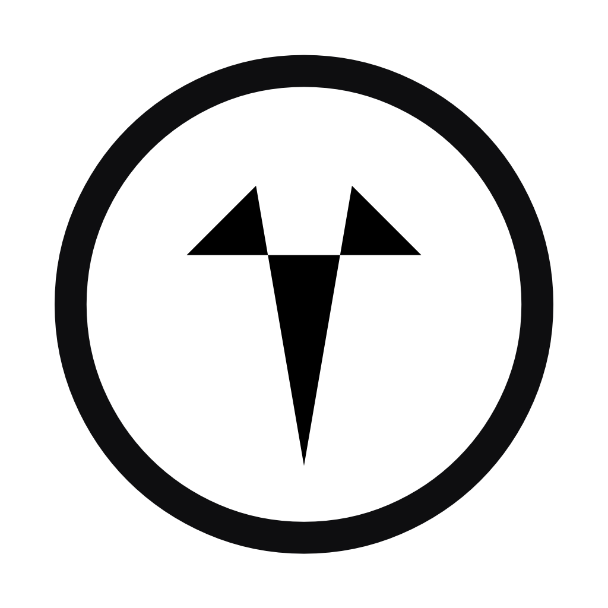
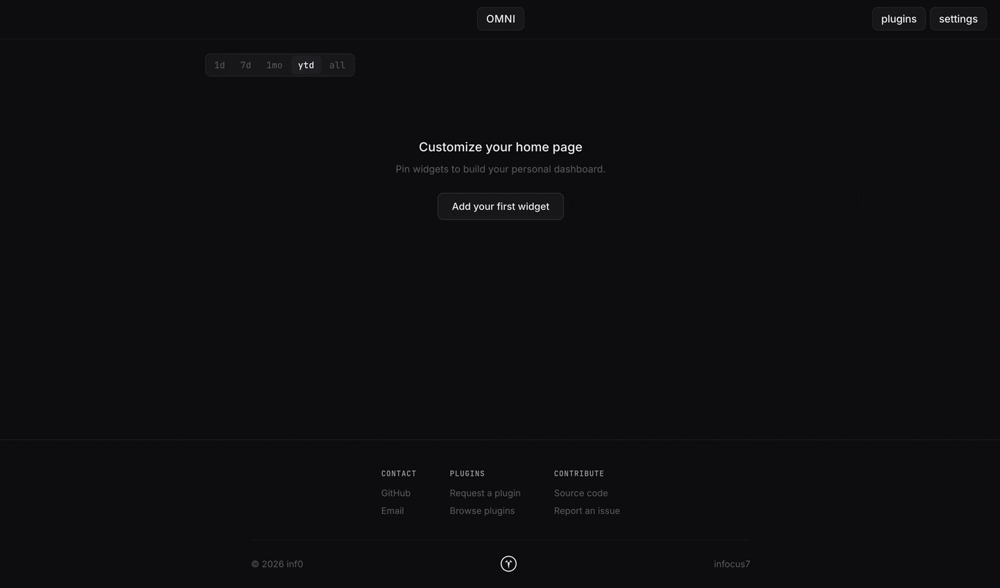

<p align="center">
  <picture>
    <source media="(prefers-color-scheme: dark)" srcset="assets/omni-white.png" />
    <source media="(prefers-color-scheme: light)" srcset="assets/omni-black.png" />
    
  </picture>
</p>

<p align="center">A personal developer dashboard for tracking contributions and team activity.</p>

<p align="center">
  
</p>

## Running

Requires Go 1.26+.

```sh
export GITHUB_TOKEN="your_token_here"
make run
```

The server starts on `:8080` by default.

### GitHub Token

You'll need a [personal access token](https://docs.github.com/en/authentication/keeping-your-account-and-data-secure/managing-your-personal-access-tokens) set as `GITHUB_TOKEN`.

Recommended setup:
- Classic token
- 30-day expiration
- Scopes: **repo**, **read:user**

### Docker

```sh
make docker-run GITHUB_TOKEN=your_token_here
```

### Kubernetes (local via kind)

```sh
make kind-setup GITHUB_TOKEN=your_token_here
make kind-forward   # in a second terminal
```

`kind-setup` creates a local cluster, builds the image, and installs the Helm chart. Re-running is safe — it upgrades the existing release.

### Development (live reload)

```sh
make check-deps
make run-live
```

## Plugins

Omni is built around a widget registry. Each plugin provides one or more widgets that users can pin, resize, and arrange on their dashboard.

### GitHub

Tracks your GitHub activity across PRs, reviews, and issues. All widgets support time filters: `1d`, `7d`, `1mo`, `ytd`, `all`.

Go to Settings → GitHub to watch orgs and repos using GitHub Search qualifier format (`org:myorg`, `repo:owner/repo`).

### ASCII

Renders animated ASCII art as dashboard widgets. Built-in animations are embedded at compile time. Additional animations can be added at runtime via the API or by dropping files into `$OMNI_DATA_DIR/ascii/` — no restart needed.

### Spacer

An invisible layout widget for padding and alignment.

## Dashboard Layout

The grid is **5 columns wide** with **130px rows**. It is responsive — at narrower viewports it collapses to 3 and then 2 columns.

By default all breakpoints share one layout (**auto** mode). Switch to **per-breakpoint** mode in settings to configure each breakpoint independently.

## Project Structure

```
app/                    # Entrypoint and HTTP routes
helm/                   # Helm chart for Kubernetes deployment
scripts/                # Developer scripts (kind cluster setup)
pkg/
  api/                  # Runtime API handlers and store watcher
  apis/                 # Kubernetes CRD type definitions
  controller/           # Kubernetes controller
  store/                # Storage interface and backends
  plugins/              # Plugin implementations
    github/             # GitHub plugin
    ascii/              # ASCII animation plugin
    spacer/             # Spacer plugin
  widgets/              # Widget interface and registry
  settings/             # User settings persistence
internal/
  cache/                # TTL cache
ui/
  templates/            # Page templates
  static/               # CSS, JS, fonts
```

## Adding a Plugin

Each plugin is a self-contained package under `pkg/plugins/`. A plugin provides widgets — components the user can pin and arrange on the dashboard.

### 1. Create the package

```
pkg/plugins/yourplugin/
  templates/
    widget.tmpl
  widgets.go
```

### 2. Implement the Widget interface

```go
type Widget interface {
    Definition() WidgetDef
    Render(ctx context.Context, filter string, sizeName string) (template.HTML, error)
}
```

Embed and parse templates once at package init:

```go
//go:embed templates/*.tmpl
var templateFS embed.FS

var tmpl = template.Must(template.ParseFS(templateFS, "templates/*.tmpl"))
```

See `pkg/plugins/github/widgets.go` for a complete example.

### 3. Register it

In `pkg/plugins/plugins.go`, add to `NewPluginManager`:

```go
reg.Register(yourplugin.NewWidget())
```

The dashboard, widget picker, and preview API all work off the registry automatically.

### Size Options

Sizes define how many grid columns/rows a widget spans:

```go
Sizes: []widgets.SizeOption{
    {Name: "small", W: 1, H: 1},
    {Name: "wide",  W: 2, H: 1},
    {Name: "tall",  W: 1, H: 2},
}
```
